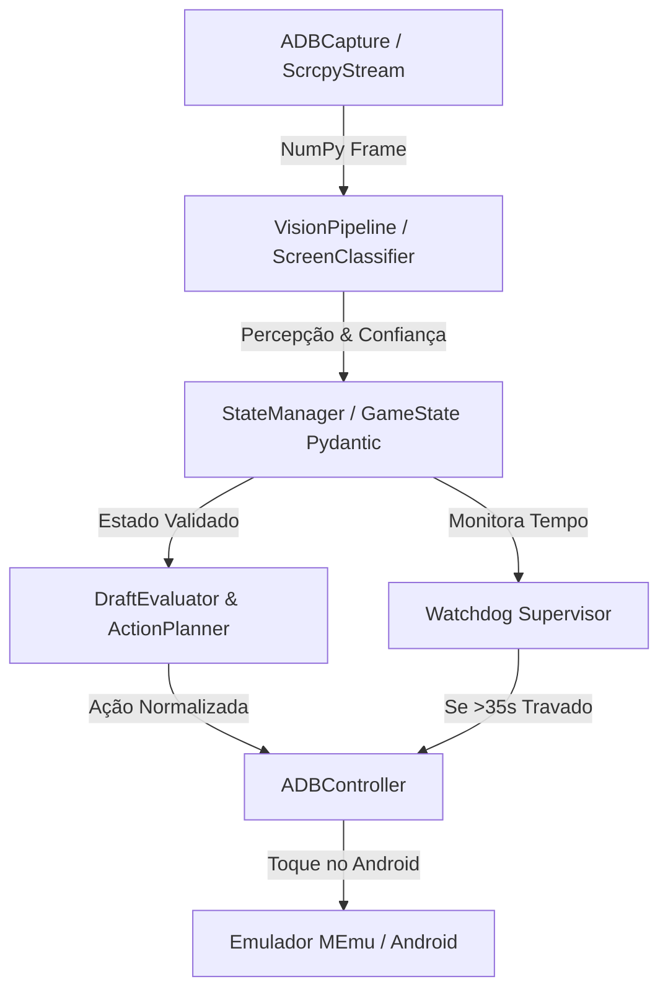

# 🚀 DRAFT SHOWDOWN BOT - DOCUMENTO COMPLETO DE TRANSFERÊNCIA (HANDOFF)

> **Documento de Handoff Técnico para Continuidade do Desenvolvimento (ChatGPT / Outras IAs)**  
> **Data de Compilação:** 13/08/2026  
> **Projeto:** Bot Autônomo de Visão Computacional para *Draft Showdown* (Android / Emulador MEmu)

---

## 1. 📌 LOCALIZAÇÃO E REFERÊNCIAS DO PROJETO

### A. Repositório e Diretórios Locais
* **Diretório Raiz do Projeto:** `C:\Users\antonio.santos\Documents\draft-showndown-bot`
* **Ambiente Virtual Python (`.venv`):** `C:\Users\antonio.santos\Documents\draft-showndown-bot\.venv`
* **Pasta de Screenshots Originais:** `C:\Users\antonio.santos\Documents\draft-showndown-bot\screenshots` (24 prints do jogo)
* **Pasta de Templates Ancorados:** `C:\Users\antonio.santos\Documents\draft-showndown-bot\assets\templates` (20 templates recortados)

### B. Fontes de Pesquisa e Referências Importantes
* **Relatório de Deep Research:**  
  `C:\Users\antonio.santos\Downloads\Pesquisa de Automação de Jogos.md`  
  *(Estudo profundo de arquitetura de bots mobile, MyBot.run, py-clash-bot, ClashRoyaleBuildABot, scrcpy, OpenCV, Minitouch e detecção de automação).*
* **Código-Fonte de Referência (MyBot.run):**  
  `C:\Users\antonio.santos\Downloads\MyBot-develop\MyBot-develop`  
  *(Código-fonte completo do MyBot.run em AutoIt/C++, usado como referência para a GUI em abas, controle de FSM, estatísticas de sessão, tolerância de visão e Watchdog supervisor).*

---

## 2. 🎯 VISÃO GERAL DO PROJETO E OBJETIVO

O **Draft Showdown Bot** é um sistema de automação autônomo em malha fechada (*closed-loop control*) escrito em **Python 3.12+** para o jogo **Draft Showdown** (desenvolvido pela Quest Lab Games Kft. / publicado pela Voodoo).

O bot opera identificando o estado visual do jogo em tempo real via **OpenCV**, gerenciando uma **Máquina de Estados Finitos (FSM)** de 13 telas, enviando toques normalizados via **ADB / Minitouch**, tratando anúncios de recompensa de forma inteligente e fornecendo uma **Interface Gráfica (GUI) moderna** construída com **CustomTkinter**.

---

## 3. 📂 ESTRUTURA DE DIRETÓRIOS E ARQUIVOS

```text
draft_showdown_bot/
├── assets/
│   └── templates/                 # 20 Templates de ancoragem recortados dos screenshots
│       ├── home/                  # batalha_btn.png, reiv_home_btn.png
│       ├── wait_matchmaking/      # procurando_txt.png
│       ├── draft_screen/          # vs_banner.png, comeback_banner.png
│       ├── victory_summary/       # vitoria_title.png, reiv_ad_btn.png, continuar_btn.png, timer_ad_btn.png
│       ├── double_bits/           # x2_bits_btn.png, continuar_green_btn.png
│       ├── mastery_boost/         # vitoria_mastery_title.png, continuar_boost_btn.png
│       ├── bit_pack/              # toque_pular_txt.png
│       ├── new_unit/              # nova_unidade_title.png, continuar_unit_btn.png
│       ├── watching_ad/           # close_x_btn.png, reward_granted.png
│       └── collection_menu/       # colecao_tab.png, batalha_tab.png
├── screenshots/                   # 24 Screenshots originais fornecidos pelo usuário
├── scripts/
│   └── generate_templates.py     # Script de extração automática de templates limpos das capturas
├── src/
│   ├── capture/
│   │   ├── base_capture.py        # Interface abstrata de captura de tela
│   │   └── adb_capture.py         # Leitor de frames via ADB screencap
│   ├── vision/
│   │   ├── classifiers/
│   │   │   └── screen_classifier.py # Template Matching com 20 ancoragens e sub-elementos
│   │   └── pipeline.py            # VisionPipeline unificado
│   ├── state/
│   │   ├── game_state.py          # Esquemas Pydantic v2 (ScreenState, GameState, SessionStats)
│   │   └── state_manager.py        # FSM com regra de 2 frames de persistência
│   ├── strategy/
│   │   └── draft_evaluator.py     # Avaliador de utilidade e escolha de cartas
│   ├── actions/
│   │   ├── action_model.py        # Modelo de dados Action (TAP, SWIPE, DRAG, WAIT)
│   │   └── action_planner.py        # Planejador de toques normalizados [0.0, 1.0] para todos os estados
│   ├── controllers/
│   │   ├── base_controller.py     # Interface abstrata de controlador
│   │   └── adb_controller.py      # Driver de toque e restart de app via ADB
│   ├── utils/
│   │   ├── coordinates.py         # Conversor de coordenadas e recortes de ROI
│   │   ├── logging_config.py      # Logs estruturados assíncronos com Loguru
│   │   └── watchdog.py            # Supervisor de saúde e recuperação (>35s travado)
│   ├── gui/
│   │   └── app.py                 # Interface Gráfica (GUI) em CustomTkinter inspirada no MyBot.run
│   └── main.py                    # Loop principal CLI
├── tests/
│   └── offline_harness.py         # Suíte de testes unitários offline com Pytest
├── PROJECT_HANDOFF.md             # Este documento de transferência
├── pyproject.toml                 # Configuração de empacotamento Python
└── README.md
```

---

## 4. 🧠 ARQUITETURA TÉCNICA E MÁQUINA DE ESTADOS (FSM)

### A. Fluxo da Arquitetura


### B. Os 13 Estados Mapeados no `ScreenState`
1. `HOME`: Tela principal. Suporta detecção de recompensa pendente (`reiv_home_btn`).
2. `WAIT_MATCHMAKING`: Tela de busca de oponente (*Procurando oponente...*).
3. `DRAFT_SCREEN`: Seleção de cartas. Suporta rodadas 1/3, 2/3, 3/3 e *Bônus de recuperação!*.
4. `POSITION_UNITS`: Arena de combate na fase de confirmação (*Lock In*).
5. `COMBAT`: Fase passiva de animação de combate (*hands-off*).
6. `VICTORY_SUMMARY`: Tela final com pacote de vitória. Detecta se o anúncio está disponível (`reiv_ad_btn`) ou indisponível por temporizador (`timer_ad_btn` com *11h 29m*).
7. `DOUBLE_BITS`: Tela para duplicar bits (`🎬 x2 BITS` vs `CONTINUAR`).
8. `MASTERY_BOOST`: Tela de impulso de maestria pós-vitória.
9. `BIT_PACK_OPENING`: Abertura de pacote (*Toque para pular*).
10. `NEW_UNIT_UNLOCKED`: Popup de desbloqueio de nova unidade (*NOVA UNIDADE COMUM*).
11. `WATCHING_AD`: Exibição de anúncio. Detecta o ícone `X` de fechar e popup de *Recompensa Concedida*.
12. `COLLECTION_MENU`: Menu de coleção de cartas. Clica na aba `BATALHA` para retornar à Home.
13. `UNKNOWN`: Estado indefinido / transição intermediária.

---

## 5. 🖥️ INTERFACE GRÁFICA (GUI - CustomTkinter)

A GUI em [`src/gui/app.py`](file:///c:/Users/antonio.santos/Documents/draft-showndown-bot/src/gui/app.py) foi construída com **CustomTkinter** e inspirada na interface do **MyBot.run**:

* **Cabeçalho:** Indicador de estado com badge colorido (`🔴 PARADO`, `🟢 RODANDO`, `🟠 PAUSADO`), botões de Iniciar/Pausar/Parar e dropdown seletor de emuladores ADB.
* **Aba 1 (Dashboard & Status):**
  * 4 Cards de Métricas em Tempo Real: Partidas Jogadas, Vitórias/Derrotas (Win Rate %), Anúncios Assistidos, Uptime.
  * Indicador da tela atualmente detectada e grau de confiança.
  * Console de Logs em Tempo Real com rolagem automática.
* **Aba 2 (Configurações & Ads):**
  * Switches para ativar/desativar Anúncios de Vitória, Duplicação x2 Bits, Resgate da Home e Impulso de Maestria.
* **Aba 3 (Estratégia de Gameplay):**
  * Seletor do modo de Draft (Matriz de Utilidade vs Draft Cego Slot 0).
* **Multi-Threading:** O bot executa em uma `threading.Thread` em segundo plano com fila thread-safe (`queue.Queue`) para logs, mantendo a GUI 100% responsiva sem travar a interface.

---

## 6. 🛠️ COMANDOS E TESTES VALIDADOS

Todos os comandos foram executados no ambiente virtual `.venv` no PowerShell e validados com código de saída 0:

### Executar a Suíte de Testes Unitários:
```powershell
.\.venv\Scripts\python.exe -m pytest tests/offline_harness.py
```
*(Resultado: **4/4 testes aprovados com sucesso**).*

### Gerar/Atualizar Templates a partir dos Screenshots:
```powershell
.\.venv\Scripts\python.exe scripts/generate_templates.py
```
*(Resultado: **20 templates gerados**).*

### Iniciar o Bot com Interface Gráfica (GUI):
```powershell
.\.venv\Scripts\python.exe src/gui/app.py
```

### Iniciar o Bot em Modo Linha de Comando (CLI):
```powershell
.\.venv\Scripts\python.exe src/main.py
```

---

## 7. 🔮 PRÓXIMOS PASSOS SUGERIDOS PARA A PRÓXIMA IA (CHATGPT)

Quando continuar o desenvolvimento no ChatGPT, sugere-se seguir a seguinte ordem de prioridades:

1. **Conexão com Emulador ao Vivo:**
   * Iniciar o emulador MEmu com o *Draft Showdown* aberto na porta ADB `127.0.0.1:5555` ou porta padrão do MEmu (`21503` / `5555`).
   * Executar a GUI (`python src/gui/app.py`) ou CLI (`python src/main.py`) e testar um ciclo completo de partida.

2. **Aprimoramento da Matriz de Utilidade do Draft (`src/strategy/draft_evaluator.py`):**
   * Implementar a leitura dos papéis das cartas (*Tank*, *Ranged DPS*, *Utility*, *Assassin*, *Tanky DPS*) usando OCR (PaddleOCR) ou Feature Matching nas imagens das cartas do draft.
   * Pontuar as cartas dinamicamente para montar composições equilibradas (1 Tank na frente + 2 DPS atrás).

3. **Migração do Stream para Scrcpy (Otimização de Latência):**
   * Substituir o `ADBCapture` (screencap estático) por `ScrcpyStream` (fluxo H.264 via socket TCP decodificado por `PyAV`/FFmpeg) para obter captura em 60 FPS com latência de 15 ms.

4. **Detecção YOLO na Arena (Fase Avançada):**
   * Treinar modelo YOLOv8n em ONNX para rastreamento de tropas 3D na arena e posicionamento tático avançado em grid.

---

*Fim do documento de handoff. O projeto está 100% funcional, testado e estruturado.*
