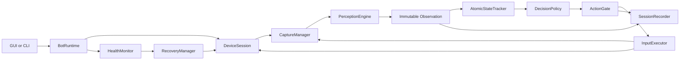

# Draft Showdown Bot — Architecture and Reliability Design

**Date:** 2026-08-13  
**Status:** Design approved section by section in conversation; pending final document review  
**Target:** One Draft Showdown account in one explicitly selected MEmu instance  

## 1. Purpose

This document defines the redesign of the Draft Showdown automation project. The goal is not to preserve the current implementation at all costs, but to retain useful boundaries and replace prototype behavior with a measurable, closed-loop system.

The design combines:

- the current Python project and its 24 manually captured reference screenshots;
- the recommendations in `C:\Users\antonio.santos\Downloads\Pesquisa de Automação de Jogos.md`;
- a read-only audit of the MyBot.run source in `C:\Users\antonio.santos\Downloads\MyBot-develop\MyBot-develop`;
- live, read-only inspection of the connected MEmu device at `127.0.0.1:21503`;
- the design decisions approved by the user during this task.

The MyBot source is a reference for operational patterns, not a code or asset donor. MyBot.run is GPLv3, so useful concepts will be independently reimplemented in Python without copying its source, DLL behavior, templates, or game assets.

## 2. Current-state findings

The current repository has a useful module outline, but the handoff's claim that it is "100% functional" is not supported by the implementation or live validation.

Confirmed limitations include:

- `VisionPipeline` fabricates three card choices, including while the screen is `UNKNOWN`.
- `DraftEvaluator` consequently behaves like a slot-zero placeholder instead of recognizing real cards.
- `ScreenClassifier` applies every template to the full frame with one global threshold of `0.70`.
- `POSITION_UNITS` and `COMBAT` exist in the enum but are not reachable through the classifier mapping.
- The live native screenshot is `720x1280`, while the manually captured desktop screenshots and generated templates use a different scale and include MEmu decoration.
- The current live HOME screen was classified as `UNKNOWN`; a reward screenshot was also misclassified as HOME in the reference corpus.
- CLI and GUI duplicate the runtime loop and already differ in policy and statistics behavior.
- The same action can be issued every loop until the screen changes.
- The boolean result of input execution is ignored.
- The FSM can combine a confirmed screen with sub-elements from an unconfirmed observation.
- A state remaining unchanged for 35 seconds is treated as a hang, even for healthy matchmaking, combat, or advertisement states.
- Capture failure returns `None` and bypasses the watchdog indefinitely.
- Normalized coordinate `1.0` maps to `width` or `height`, outside the framebuffer.
- Capture and input can independently select the first ADB device.
- Tk widgets are updated from the bot worker thread.
- The normal `pytest` discovery finds no tests because the only test module is named `offline_harness.py`.
- The explicit four tests pass, but do not validate real visual classification, sequences, duplicate actions, recovery, or live behavior.
- The active virtual environment uses Python 3.14 although the project only declares Python 3.12 or newer; compatibility must be proven before adding OCR and inference libraries.

No project source was changed during this audit. A single live diagnostic screenshot was captured at `.artifacts/live-screen.png`; no input was sent to the emulator.

## 3. Goals and non-goals

### Goals

- Reliably automate one Draft Showdown account on one MEmu instance.
- Make every input traceable to fresh visual evidence.
- Prefer safe inaction over a low-confidence or stale click.
- Recognize real draft choices and produce explainable decisions.
- Support positioning, results, rewards, and configured advertisement flows.
- Recover progressively from known UI, capture, ADB, app, and worker failures.
- Use the same perception and runtime contracts in live and replay modes.
- Record enough causal evidence to reproduce and fix failures offline.
- Optimize latency only where measurements show it affects correctness or throughput.

### Non-goals

- Running multiple bots or multiple emulator instances simultaneously.
- Building multi-account scheduling, worker pools, or a multi-instance dashboard.
- Reproducing the MyBot GUI or its Clash of Clans-specific global architecture.
- Treating the manual screenshots as perfect production templates.
- Running OCR on the entire screen by default.
- Introducing YOLO before classical vision is measured and found insufficient.
- Automatically changing emulator resolution, density, or other MEmu settings.
- Uncontrolled online learning or automatic promotion of new models and weights.

The code should keep sensible interfaces, but no multi-instance infrastructure will be implemented for hypothetical future use.

## 4. Architecture

The application has one runtime and one selected device session. GUI and CLI are control clients, not alternate implementations of the game loop.



### Main components

- `BotRuntime`: owns lifecycle, scheduling, cancellation, and component wiring.
- `DeviceSession`: stable identity and shared ADB connection for the selected device.
- `CaptureManager`: captures or reuses frames according to an explicit freshness policy.
- `PerceptionEngine`: runs state-specific visual detectors on one immutable frame.
- `AtomicStateTracker`: confirms whole observations and maintains game context.
- `DecisionPolicy`: converts confirmed state into an intention.
- `ActionGate`: checks freshness, preconditions, cooldown, and idempotency.
- `InputExecutor`: serializes input through the selected backend and returns a typed receipt.
- `PostconditionVerifier`: determines whether an action produced the expected visual result.
- `HealthMonitor`: observes capture, ADB, app, state progress, and runtime heartbeat.
- `RecoveryManager`: performs bounded, progressive recovery.
- `SessionRecorder`: asynchronously stores causal artifacts and structured events.
- `EventBus`: carries runtime events to GUI, CLI, metrics, and logs without UI thread violations.

## 5. Core data contracts

All contracts should be typed and immutable at component boundaries. Pydantic may be used for configuration and serialized events; lightweight frozen dataclasses may be preferable on hot paths.

### Frame

```text
Frame
├── id / sequence
├── image
├── captured_at_monotonic
├── device_serial
├── backend
├── framebuffer_size
├── display_profile_version
├── connection_generation
└── capture_generation
```

Any input increments `capture_generation`, invalidating frames captured before the action. Detectors never initiate implicit recapture; every detector in one perception round sees the same `frame_id`.

### Detection

```text
Detection
├── element_id
├── confidence
├── bounding_box
├── detector_id
├── frame_id
├── alternatives
└── evidence
```

No detector returns magic strings, mixed coordinate systems, or heterogeneous sentinel values.

### Observation

```text
Observation
├── frame metadata
├── screen candidate and score
├── detections
├── OCR results
├── overlays
├── visual fingerprint
└── diagnostics summary
```

The state tracker promotes or rejects the entire observation atomically.

### Action transaction

```text
ActionAttempt
├── action_id
├── intent
├── source_frame_id
├── source_state
├── precondition
├── detected target or validated fallback
├── idempotency_key
├── deadline
├── expected postcondition
└── retry policy
```

Action outcomes are `BLOCKED`, `FAILED_BEFORE_SEND`, `SENT`, `COMMIT_UNKNOWN`, `CONFIRMED`, or `FAILED_POSTCONDITION`. Automatic retry is allowed only after `FAILED_BEFORE_SEND`.

## 6. Device, display, and input

### Single explicit device

The GUI may list ADB devices, but exactly one serial must be selected before starting. Capture, input, recovery, and telemetry receive the same injected `DeviceSession`. If more than one device exists, the runtime must not silently choose `devices[0]`.

### Display profile and coordinates

At startup and after reconnect or rotation, read:

- framebuffer size;
- Android logical size;
- density;
- orientation;
- content rectangle;
- minitouch coordinate limits when applicable.

Coordinate spaces are explicit: normalized content, framebuffer, Android logical, Minitouch, and optionally window-client. Mapping clamps the final point to `[0, width - 1] x [0, height - 1]` and is covered by property tests.

### Targets and safe sampling

The preferred target is a detected bounding box. `TapTarget` adds a safe inset and a bounded sampling policy. Sampling must always remain within the valid box. Tests use an injected deterministic random source.

Fixed normalized points are permitted only as documented fallbacks when:

- the containing screen is strongly confirmed;
- the display profile is valid;
- the target area is known to be stable;
- no detected obstacle overlaps it;
- the fallback has dedicated replay and live validation.

### Input backends

Initial production backend: ADB input through the shared device session.

Potential negotiated order after validation:

1. Minitouch socket.
2. Minitouch persistent pipe.
3. ADB input fallback.

Fallbacks are visible in `InputReceipt`; they are never silent. A single bounded worker serializes actions. A timeout after a potentially transmitted tap results in `COMMIT_UNKNOWN`, not a retry.

## 7. Capture and perception

### Capture policy

`CaptureManager` supports explicit requests:

- `REUSE_OK(max_age)`: reuse a sufficiently fresh frame.
- `FRESH_REQUIRED(after_generation)`: capture a frame newer than an action or state event.

Initial backend priority is based on reliability, not an assumed FPS claim:

1. ADB raw/exec-out where robustly supported.
2. adbutils PNG/PIL capture.
3. Scrcpy stream as a later interchangeable optimization.

Every frame reports the active backend and capture latency. Backend health and fallback reason are observable.

### Hierarchical perception

The engine does not run all detectors over the whole frame. It uses:

1. device and orientation validation;
2. cheap regional color and multipixel probes;
3. state priors and transition context;
4. template or feature matching inside typed ROIs;
5. field-specific OCR;
6. specialized card or arena models only where needed.

Color probes use explicit RGB, HSV, or Lab semantics and per-probe tolerance. They are gates or supporting evidence, not the sole authorization for consequential input.

### Asset manifest

Templates and anchors are described by a versioned manifest containing at least:

- stable element identifier;
- associated states and overlays;
- ROI and coordinate space;
- matching method;
- calibrated threshold;
- variants and optional mask;
- expected scale or scale range;
- positive fixtures;
- negative fixtures;
- asset/game version.

Thresholds are calibrated per element with positive and negative data. Thresholds are not hidden solely in filenames.

### Manual and automatic captures

The 24 manual screenshots remain useful as:

- visual documentation;
- seeds for state and ROI definitions;
- examples of known UI variation;
- hard cases or negative examples after review.

They are stored separately from native automatic captures and are not assumed to be pixel-perfect templates. Native frames are captured directly from Android and include device metadata.

### Diagnostics

On uncertainty or failure, the asynchronous artifact sink stores the exact analyzed frame, not a recapture. An artifact bundle can include:

- original frame;
- ROI crops and overlays;
- winning and top alternative detections;
- scores and thresholds;
- OCR input and result;
- state and action trace;
- structured JSON metadata.

## 8. State model

Three independent dimensions prevent a flat enum from mixing unrelated concerns:

### Runtime lifecycle

`STARTING`, `RUNNING`, `PAUSED`, `RECOVERING`, `STOPPING`, `STOPPED`, `FAILED`.

### Operational health

`HEALTHY`, `NO_FRAME`, `ADB_OFFLINE`, `FRAME_FROZEN`, `APP_BACKGROUND`, `WORKER_UNRESPONSIVE`, and related typed conditions.

### Game state

Confirmed screens such as HOME, MATCHMAKING, DRAFT, POSITIONING, COMBAT, result/reward screens, advertisement screens, collection, and UNKNOWN. Popups are usually overlays rather than mutually exclusive game states.

### Temporal confirmation

Confirmation combines detector-specific confidence, a short temporal window, previous state, allowed transitions, and mandatory evidence for actionable states. A strong observation can resynchronize the FSM after a skipped animation. Transition rules are priors, not an absolute barrier.

`UNKNOWN` is safe and non-actionable:

- short-lived UNKNOWN waits for more frames;
- persistent UNKNOWN records diagnostics and asks recovery to evaluate the cause.

## 9. Closed-loop actions

`DecisionPolicy` emits an intention such as `StartBattle`, `SelectDraftCard`, `PlaceUnit`, `ConfirmPositioning`, `ClaimReward`, `CloseAd`, or `ReturnHome`. It does not emit an arbitrary coordinate.

Before input, `ActionGate` verifies:

- runtime is running and not cancelled;
- the source frame is fresh;
- the confirmed state still satisfies the precondition;
- the target is valid and unobstructed;
- the same idempotency key is not active or cooling down;
- the action is allowed by user configuration.

After input:

- capture cache is invalidated;
- a newer frame is required;
- the expected postcondition is evaluated;
- only visual confirmation records success and updates statistics;
- ambiguity blocks duplicate taps and creates a diagnostic event.

All waits are cancellation-aware. Pause and stop prevent unsent actions, and stop performs a bounded worker join instead of relying on a daemon thread.

## 10. Health monitoring and recovery

Health is not inferred solely from time spent in one game state. The monitor tracks:

- last valid frame and capture failure streak;
- repeated identical frame fingerprints where motion is expected;
- ADB latency and errors;
- selected device presence;
- app process and foreground package;
- per-state progress and deadlines;
- pending action age and postcondition status;
- worker heartbeat.

Matchmaking, combat, and advertisements receive state-appropriate expectations. A static but valid combat frame does not automatically trigger an app restart.

### Recovery ladder

1. Wait for or force a fresh frame.
2. Dismiss a known obstacle.
3. Send BACK only when the current recovery policy permits it.
4. Reconnect ADB/device session.
5. Bring the app to the foreground.
6. Restart only the application.
7. Restart MEmu, if enabled and necessary.
8. Restart the bot runtime/worker.
9. Open the circuit and quarantine the session for user inspection.

Each step has a typed cause, bounded attempts, backoff, deadline, success evidence, and diagnostic capture before escalation. Recovery failure is not discarded by resetting the FSM.

A lightweight external supervisor may monitor the single runtime so it can detect a worker that cannot report its own failure. This is not multi-instance infrastructure.

## 11. Draft strategy and card recognition

### Card recognition

For each confirmed draft slot:

1. locate the slot from screen anchors;
2. crop all slots from the same frame;
3. extract frame, rarity, color, and icon evidence;
4. OCR the name when present and useful;
5. apply feature matching or a small classifier;
6. combine evidence into a typed `CardDetection` with alternatives.

The system returns `UNKNOWN_CARD` rather than inventing a name or role.

### Card knowledge base

A versioned data store describes canonical IDs, aliases, visual references, role, range, positioning preference, known synergies, and the game version. Observed results can be stored separately from curated facts.

### Explainable utility policy

The initial policy is deterministic and versioned. A choice score may combine:

- base value;
- composition need;
- synergy with earlier choices;
- positioning fit;
- opponent information, when reliably visible;
- statistically significant historical evidence;
- redundancy and uncertainty penalties.

Each decision records the ranked candidates and score components.

If the draft screen and slot boxes are confirmed but card identity remains uncertain, the runtime retries alternative perception within the available time. Near a confirmed deadline, it may use a configured conservative fallback. The fallback acts on a confirmed slot box, never on fabricated card data.

No strategy weights or models are promoted automatically from live results.

## 12. OCR and learned models

OCR is field-specific. `OcrProfile` defines ROI, resize, color preprocessing, charset, parser, and semantic validator for card names, round counters, resources, timers, rewards, and result text.

The OCR interface is backend-neutral. The implementation chooses a backend only after compatibility and benchmark validation in the pinned Python environment.

YOLO is reserved for truly dynamic arena objects when ROI templates, color segmentation, and feature methods cannot meet measured requirements. A production model requires:

- a labeled, sequence-separated dataset;
- per-class precision and recall;
- false-positive analysis;
- resolution and effects variation;
- latency measurement;
- ONNX export and production benchmark;
- comparison against a simpler classical baseline.

Scrcpy, Minitouch, OCR engines, and YOLO are replaceable adapters, not assumptions embedded in the state machine.

## 13. Arena positioning

Positioning uses detected geometry:

1. locate arena anchors;
2. derive the valid arena rectangle and grid transform;
3. detect draggable units/cards and allowed or occupied cells;
4. construct a formation from recognized roles;
5. execute one drag at a time;
6. confirm each placement on a fresh frame;
7. press Lock In only when the expected formation is visually valid.

The initial formation policy places durable frontline units ahead of ranged or utility units, maintains useful spacing, and adapts to unavailable cells. More advanced strategy remains separate from perception and input.

## 14. Recorder and dataset lifecycle

The recorder captures event-driven samples:

- before and after every action;
- state transitions;
- UNKNOWN or low-margin decisions;
- OCR or detector disagreement;
- failed postconditions;
- recovery steps;
- end-of-match outcome.

Perceptual hashing deduplicates near-identical frames. Dataset partitions are separated by session or sequence, not individual frames, preventing train/validation leakage.

Promotion flow:

```text
capture -> triage -> label -> offline regression -> calibration
        -> held-out validation -> versioned approval
```

## 15. GUI, configuration, telemetry, and statistics

### GUI

The GUI sends lifecycle and configuration commands to `BotRuntime` and consumes immutable events through a thread-safe channel. Only the Tk main thread mutates widgets. The GUI never contains a second game loop.

### Configuration

Versioned Pydantic settings are persisted atomically and include:

- selected device serial;
- reward and advertisement policies;
- draft strategy version and fallback;
- recovery limits;
- diagnostics retention;
- optional backend flags.

### Telemetry

Structured events distinguish attempted, sent, confirmed, failed, and ambiguous actions. Metrics include:

- capture, perception, decision, input, and confirmation latency;
- UNKNOWN rate and state confusion;
- detector score margins;
- action outcome counts;
- recovery cause and step counts;
- match outcomes and confirmed rewards;
- last valid frame and heartbeat age.

Statistics are updated from confirmed domain events, never from planned actions.

## 16. Verification strategy

### Unit and property tests

- coordinate bounds, rotations, aspect ratios, and content rectangles;
- randomized target samples always inside safe boxes;
- frame freshness and post-action invalidation;
- atomic observation promotion;
- transition and UNKNOWN behavior;
- action idempotency and `COMMIT_UNKNOWN` semantics;
- OCR parsers and semantic validation;
- cancellation during waits, input, and recovery.

### Component tests

- detector positives, negatives, variants, and calibrated thresholds;
- capture fallback and health reporting;
- fake ADB partial failures and reconnect;
- Minitouch fallback only when implemented;
- artifact bundles refer to the exact analyzed frame.

### Sequence replay

`ReplayCapture`, fake monotonic clock, and `DryRunController` run complete recorded sequences through the real runtime. Assertions cover state transitions, decisions, no duplicate action, postconditions, timeout behavior, and recovery.

### Live rollout

```text
observe-only -> isolated actions -> complete phase -> complete match
             -> consecutive supervised cycles -> unattended soak
```

Live input remains opt-in and begins with an allowlist. Any incorrect click becomes a mandatory regression fixture before progressing.

## 17. Quality gates

Before unattended execution:

- no normal action is emitted from UNKNOWN;
- no coordinate escapes its validated target;
- replay produces zero duplicate actions;
- ambiguous delivery never causes automatic retry;
- actionable-state precision is at least 99% on held-out sequences;
- critical element detection prioritizes precision over immediate recall;
- capture loss, ADB loss, frozen frame, and app closure recover as designed;
- GUI remains responsive and thread-safe;
- results and rewards are counted only after confirmation;
- every action and recovery can be reconstructed from structured evidence.

Absolute perfection cannot be asserted from a small dataset. Readiness is based on held-out metrics and consecutive supervised live cycles. A live failure resets the relevant rollout gate and enters the regression corpus.

## 18. Definition of functional completion

The application is functionally complete when it repeatedly:

1. connects to the explicitly selected MEmu device;
2. identifies the initial screen safely;
3. starts matchmaking;
4. completes real draft rounds with recognized or policy-governed choices;
5. positions and confirms units;
6. waits through combat without false watchdog recovery;
7. handles results, configured rewards, and supported advertisements;
8. returns to HOME;
9. recovers from the documented failure classes;
10. produces reproducible logs and artifacts for every decision.

## 19. Implementation phases

### Phase 1 — Safe foundation

- pin a supported Python runtime and dependency set;
- create the shared runtime and explicit device session;
- add immutable frames, typed geometry, cancellation, event bus, replay, and dry-run;
- fix coordinate and test discovery defects;
- establish regression fixtures before changing behavior.

### Phase 2 — Reliable perception

- add automatic native capture and the asset manifest;
- implement ROI detectors, per-asset thresholds, color gates, and diagnostics;
- cover all real states and remove fabricated choices;
- build the first labeled sequence corpus.

### Phase 3 — True closed loop

- implement atomic state tracking, intents, action gate, ledger, postconditions, and recovery ladder;
- unify GUI and CLI over `BotRuntime`;
- validate observe-only and isolated live actions.

### Phase 4 — Draft intelligence

- implement card recognition, OCR profiles, card knowledge base, and explainable utility ranking;
- validate complete draft sequences.

### Phase 5 — Positioning and complete cycle

- calibrate arena geometry and placement confirmation;
- validate Lock In, combat waiting, results, rewards, and return to HOME;
- complete supervised end-to-end cycles.

### Phase 6 — Measured optimization

- profile bottlenecks;
- add Scrcpy, Minitouch, ONNX, or YOLO only where benchmarks and accuracy data justify them;
- run unattended soak validation.

## 20. Deferred implementation choices

The design intentionally defers choices that require measurements or dataset evidence:

- exact OCR engine;
- whether Scrcpy materially improves the game loop;
- whether Minitouch is needed beyond ADB input;
- whether card recognition needs a learned model;
- whether arena perception needs YOLO;
- exact detector thresholds and temporal windows;
- exact number of supervised cycles required for unattended release.

These decisions do not alter the component contracts above and will be resolved through tests and benchmarks during the corresponding phase.
